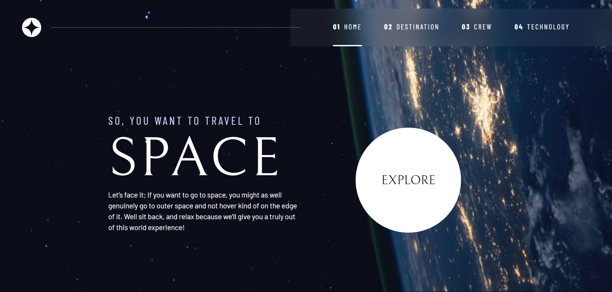

# Space Tourism Website Documentation

## Overview

This project focuses on creating a responsive web design with CSS and enhancing user experience with JavaScript. It includes custom properties, utility classes, and components for building a modern and visually appealing website.

## Custom Properties

The `:root` selector defines custom properties for colors, font sizes, and font families. Media queries adjust these properties for different screen sizes, ensuring a responsive design.

## Reset

A modern CSS reset is applied to ensure consistent styling across different browsers. It includes box sizing, reset margins for various elements, and sets up the body with a clean font and background.

## Utility Classes

Utility classes are provided for general styling, colors, and typography. These classes offer flexibility and consistency throughout the design.

## Components

### Large Button

A custom-styled large button component with a subtle hover effect is included. It adds visual interest and interactivity to the design.

### Primary Header and Navigation

The primary header includes a logo and navigation links. On smaller screens, a mobile navigation toggle is available. The navigation features underline indicators and adjusts its layout based on screen size.

### Tab Navigation

JavaScript functionality is implemented for tab navigation. Users can navigate through tabs using keyboard inputs and click events. Tab panels and corresponding images are dynamically switched based on user interactions.

## Page-specific Backgrounds

Distinct background images are applied to different sections of the website based on the page. Media queries ensure proper display on various devices.

## Layout

Grid containers are used for structuring content, and their layouts adapt to different screen sizes. The design incorporates responsive typography and spacing.

## Screenshot

## Links

<!-- - Solution URL: [Add solution URL here](https://your-solution-url.com) -->

-   Live Site URL: https://shoppinglistapplication.netlify.app
-   Frontend Mentor - [@Gaurav-GD24](https://www.frontendmentor.io/profile/Gaurav-GD24)
-   Twitter - [@Gaurav_GD24](https://twitter.com/Gaurav_GD24)

## Usage

1. Clone the repository.
2. Link the provided CSS file in your HTML.
3. Include the JavaScript file for enhanced functionality.

